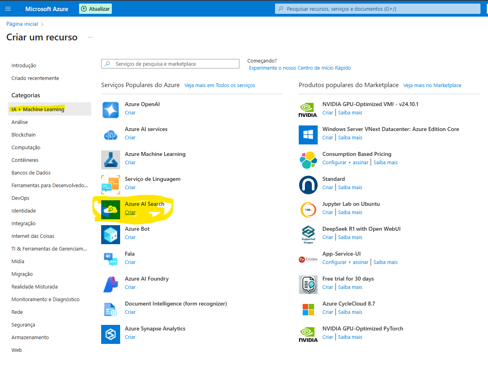
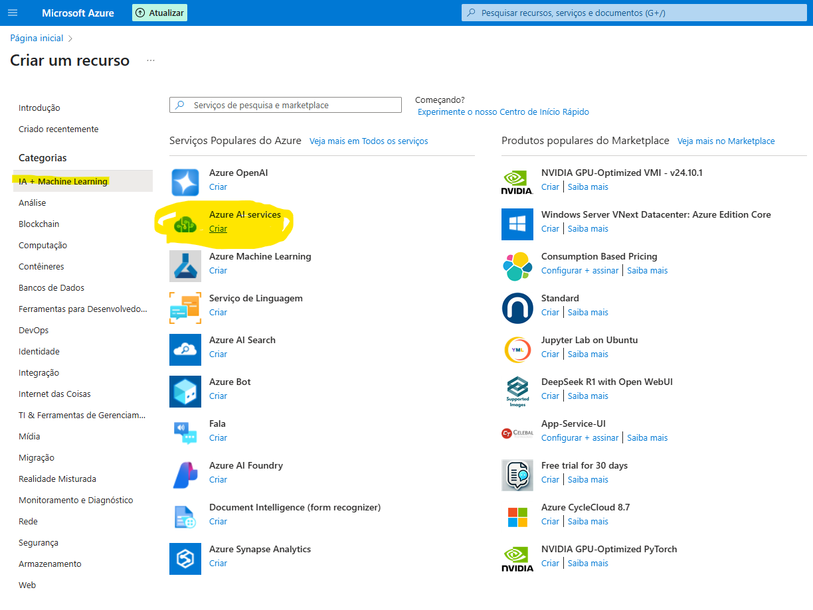
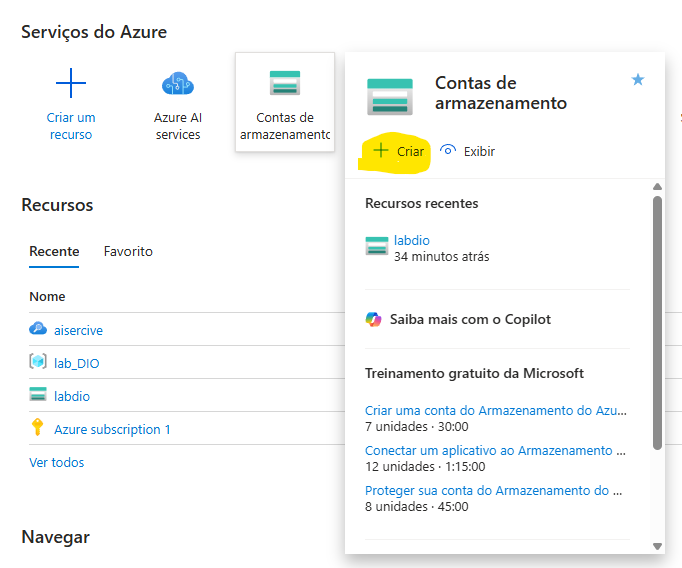
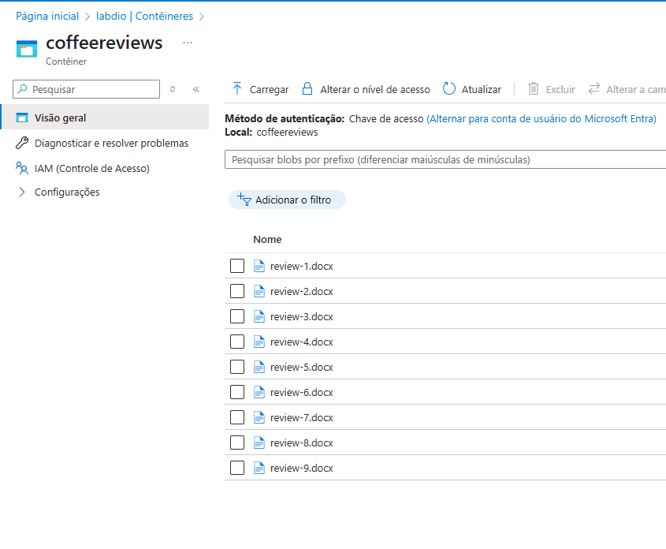
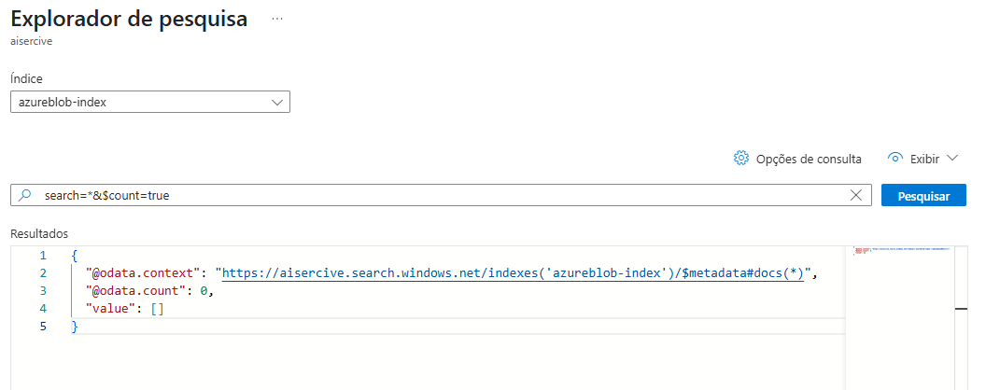
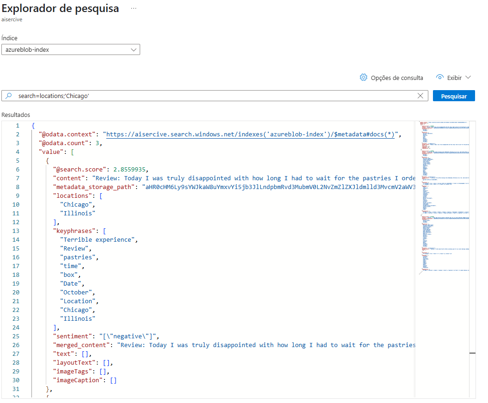

# Azure Cognitive Search: Indexação e Consulta de Dados com IA

## 📝 Descrição
Este projeto foi desenvolvido como parte do desafio prático da DIO, com o objetivo de aplicar técnicas de organização, ingestão de dados e indexação utilizando inteligência artificial através do Azure Cognitive Search.

## 🛠️ Tecnologias Utilizadas
- Azure Cognitive Search
- GitHub
- Markdown

## 🔄 Etapas Realizadas
1. Ingestão de dados
2. Criação do índice de pesquisa
3. Exploração e consulta dos dados

*(Screenshots ilustrando as etapas serão adicionadas na pasta `/images`.)*

## ✅ Resultados Alcançados
- **Indexação Eficiente**: Os comentários foram indexados com sucesso, permitindo buscas rápidas e precisas.
- **Análise de Sentimentos**: A aplicação de técnicas de NLP possibilitou a classificação dos comentários em positivos, negativos e neutros, oferecendo insights valiosos sobre as opiniões dos usuários.
- **Visualização Interativa**: A integração com o Azure AI Search proporcionou uma interface intuitiva para explorar os dados e os resultados das análises.
- **Aprendizado Prático**: A execução deste projeto consolidou conhecimentos em serviços de IA da Azure, manipulação de dados e desenvolvimento de soluções baseadas em nuvem.
- **Outras observações**: Tal seriço de IA também permite que outras pesquisas possam ser feitas diretamente no Search Explorer utilizando a automação, como a busca por locais, palabras-chave, nomes etc. Vale destacar que isto também pode ser usado dentro de uma aplicação, tornando a utilização mais fácil e intuitiva.

## 🚀 Como o Projeto Foi Executado​

A seguir está o passo a passo completo para execução do projeto no Azure:

### 1. Criação do Azure AI Search

Foi criado o serviço **Azure AI Search**, essencial para realizar buscas inteligentes e aplicar análise de sentimentos sobre os dados.  
📷 

### 2. Criação do Azure AI Services

Este recurso permite acesso aos modelos de linguagem e serviços de inteligência artificial da Microsoft.  
📷 

### 3. Criação de uma Conta de Armazenamento (Blob Storage)

- Criada uma conta de armazenamento.  
- Permissão de **acesso anônimo ao Blob** foi habilitada.  
- Criado um contêiner público.  
- Os comentários foram enviados para esse contêiner.  
📷 

### 4. Importação dos dados para o Azure AI Search

A partir do Blob Storage, os dados foram importados para o Azure AI Search, utilizando a opção de enriquecimento de dados (cognitive skills).  
📷 

### 5. Exploração e Validação dos Resultados

Utilizamos o portal do Azure para:
- Explorar os dados indexados.  
- Verificar se a **cadeia de consulta** está ativa.  
📷   
- Realizar filtros por localizações e sentimentos.  
📷 

---

Sinta-se à vontade para clonar este repositório, sugerir melhorias ou utilizá-lo como base para seus próprios experimentos!

---

## 📖 Referências
- [Documentação Oficial do Azure Cognitive Search](https://learn.microsoft.com/pt-br/azure/search/search-what-is-azure-search)
- [Curso DIO: Azure Cognitive Search](https://www.dio.me)

---

Projeto desenvolvido como parte do bootcamp Cloud com IA – DIO e XP Investimentos.

---

Este projeto permitiu colocar em prática os conceitos de nuvem e IA aprendidos em curso/bootcamp. Foram utilizados serviços reais de computação em nuvem e aplicações de linguagem natural para simular cenários profissionais.

---

## 🚀 Autor

- **Ismael Lopes**  
- GitHub: [@ismael12br](https://github.com/ismael12br)  
- LinkedIn: [linkedin.com/in/ismael-lopes](https://linkedin.com/in/ismael-lopes)
